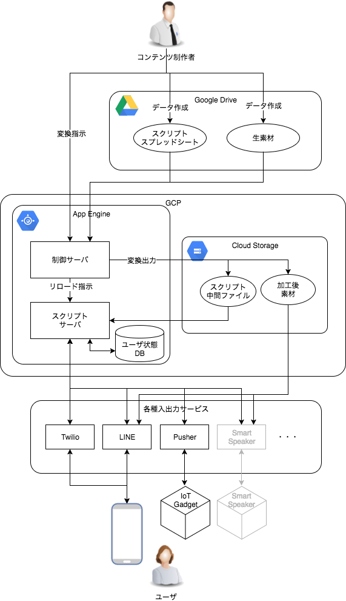

# XStoryBot - Transmedia Storytelling Bot

## 概要

複数のメディアを横断するストーリーテリングでの利用を意図して設計された、チャットボットシステムです。

自然文入力への対応が弱い代わりに、決められたワードの入力に反応して、インタラクティブなストーリーを提供することを得意としています。

シナリオを Google Sheets 上で記述できるため、シナリオ作成者との作業分担が行いやすいという特徴もあります。

現在の公開版は Python 3.11 で動作し、Cloud Run または AWS 向けに構成されています。

### プロジェクトの状態

- 小規模な実験では安定して動いていますが、負荷テストも行っていない、α版の品質です。
- ドキュメントがほとんどありません。
- 仕様は大幅に変わる可能性があります。
- 個人の趣味のプロジェクトですので、あまり精力的な開発はできません。

## システム構成
上半分のコンテンツ制作者から見えるシステムと、下半分のユーザから見えるシステムに分かれます。

この構成図は旧GAE版を基にした概念図です。現行版のGCP構成ではCloud Run、AWS構成ではAPI Gateway、Lambda、Fargateなどが、図中のGoogle App Engineに相当する役割を担います。

## できること

ユーザからの入力テキストに対して、どんな反応を返すのか、スプレッドシート上で定義します。
条件は、完全一致、または正規表現で記述できます。

シナリオはシーン単位で管理されており、シーン毎にユーザへ異なるリアクションを提供できます。
ユーザ毎に現在どのシーンに居るかが保存されています。

また、記述方法がこなれていないためオススメできませんが、フラグ管理にも対応しています。

複数のbotを同時に実行できます。ユーザの状態は既定ではbotごとに分離され、同じ`state_namespace`を設定したbot間では共有できます。

## 対応サービス

plugin によって拡張可能な設計になっています。
現時点で対応しているサービスは以下の通りです。

### ユーザとの対話

- LINE@ のボットシステム（[LINE Messaging API](https://developers.line.me/ja/services/messaging-api/)）
  - ボタン・カルーセル・イメージマップなど、一部の特殊表示に対応しています。
  - WebHook などを契機にした Push messages にも対応していますが、友だちが50人を越えると[月額32400円が必要](https://at.line.me/jp/plan)です。
- [Twilio](https://twilio.kddi-web.com/) （電話・SMS）
  - 電話がかかってきたことをトリガーに SMS を送信し、返信の内容によって電話をかける、といったことが可能です。
  - しかし、電話にせよ、SMS にせよ、とにかく[単価が高い](https://twilio.kddi-web.com/price/)ため、大規模な利用は困難です。
- WebAPI（認証付き action API）

### IoT 機器などとの連携

- [Pusher](https://pusher.com/)
- 一般的な WebHook

### シナリオファイルの読み込み

- Google Sheets

## インストール手順

このリポジトリを clone した上で、Python 3.11 環境へ必要なパッケージをインストールします。

    > git clone https://github.com/alt-core/XStoryBot.git
    > python3 -m pip install -r requirements.txt

Cloud Runへデプロイする場合は、利用するGCPプロジェクトを準備してください。

以下、特殊な前準備が必要です。

- https://console.developers.google.com/apis/api/sheets.googleapis.com/overview
  - 展開先のプロジェクトにて、Sheets API を有効化
- 同様の手順で Google Cloud Storage も有効化
- GCP のダッシュボードでサービスアカウントを作成
  - json 形式でクレデンシャルファイルをダウンロード
- Google Sheets でシナリオのスプレッドシートを作成
  - 共有で上述のサービスアカウントのメールアドレスに招待
    - 招待する時は「通知」のチェックボックスを外す
- LINE@ を使う場合
  - LINE@ のアカウントを作成し、接続に必要な情報をメモ
  - LINE@ の webhook に 〜/line/callback/＜botname＞ を設定
- Twilio を使う場合
  - Twilio の電話番号を取得し、必要な情報をメモ
  - Twilio の webhook に 〜/twilio/callback/＜botname＞ を設定

続いて、設定ファイルと環境変数を準備します。ローカルで直接実行する場合は、次のようにローカル用の設定を作成します。

    > cp settings.yaml.template settings.yaml

`settings.yaml`を必要に応じて編集し、`.env.template`に列挙された環境変数を実行環境へ設定してください。Dockerイメージでは`settings.yaml`は取り込まず、`settings.yaml.template`をイメージ内の設定として使うため、コンテナ用のBot・plugin構成はこちらを編集します。`XSBOT_DEPLOY_ENV`には適用する環境別設定（例: `prod`、`stg`、`dev`、`test`、`local`）を指定します。

GCPとGoogle Sheetsで使うサービスアカウントJSONはコンテナイメージへ含めず、Secret Managerから読み取り専用ファイルとしてマウントし、それぞれのコンテナ内パスを`GOOGLE_APPLICATION_CREDENTIALS`と`SHEETS_SERVICE_ACCOUNT`へ指定してください。同じサービスアカウントを使う場合は、両方に同じパスを指定できます。

sheet_id は Google Sheets の編集時に URL に含まれるランダム英数字です。
api_token は、WebAPI などでの認証のために使われる情報です。必ず独自の値を設定してください。

利用するpluginとBot interfaceは、ローカルでは`settings.yaml`、コンテナでは`settings.yaml.template`で設定します。

設定後、`Dockerfile`からコンテナイメージを一度ビルドし、同じイメージをCloud RunのAPI用サービスとビルダー用サービスへデプロイします。API用は既定の`app:app`を使い、ビルダー用だけ`XSBOT_APP_MODULE=app_builder:app`を設定します。それぞれのURLを`XSBOT_APP_BASE_URL`と`XSBOT_BUILDER_BASE_URL`へ指定し、Cloud Tasksには同じプロジェクト・リージョンで`build-queue`、`action-queue`、`group-message-queue`の3キューを作成します。現行のTaskQueueはOIDCトークンを付けないため、両サービスはCloud IAMで未認証HTTP呼び出しを許可し、保護が必要なrouteはWebhook署名、フォーム認証、または`X-API-Token`で保護します。

現行GCP実装はシナリオとメディアをオブジェクトACLで公開します。そのため、保存先にはオブジェクト単位の公開を許す専用バケットが必要で、Uniform bucket-level accessとPublic Access Preventionは有効にできません。バケット全体を公開する必要はありません。

共有APIトークンで利用できるグループ管理APIとして、`POST /api/v1/groups/<group_id>/add_members`と`GET /api/v1/groups/<group_id>/members`があります。認証には`X-API-Token`ヘッダーを使用します。

### AWSへデプロイする場合

AWS CLI、AWS SAM CLI、DockerとAWS認証情報、既存のECR repositoryを準備してください。Google Sheets資格情報、管理者認証JSON、runtime秘密値JSONは、AWS管理KMSキーを使うParameter Storeの`SecureString`へ事前に登録します。

管理者認証JSONは`python3 tools/generate_admin_auth.py`で生成できます。

`AWS_REGION`、`XSBOT_AWS_STACK_NAME`、`XSBOT_AWS_ECR_REPOSITORY`、`XSBOT_AWS_ENVIRONMENT`、`XSBOT_AWS_SHEET_ID`、`XSBOT_AWS_SHEETS_CREDENTIAL_PARAMETER`、`XSBOT_AWS_ADMIN_AUTH_PARAMETER`、`XSBOT_AWS_RUNTIME_SECRETS_PARAMETER`を環境変数に設定し、`./deploy_aws.sh`を実行します。秘密値そのものはスクリプトへ渡しません。

API、2つのworker、Fargateで同じECR imageを共用するため、スクリプトはDockerで一度だけ`linux/amd64` imageをbuild/pushし、`ImageUri`をSAMへ渡します。同一imageの再buildを避けるため`sam build`は実行しません。

## シナリオの作成

Google Sheets 上でシナリオを作成します。
詳細は、シナリオフォーマットのドキュメント（未作成）を参照してください。

## ダッシュボードからシナリオ読み込み

デプロイ先のホストの 〜/dashboard/ にブラウザでアクセスすると管理画面が開きます。

ダッシュボードではユーザー名とパスワードによる認証が要求されます。管理者認証JSONは環境変数またはAWS Parameter Storeから設定してください。

ダッシュボードにある「シナリオ修正の反映」のボタンを押すことで、Google Sheets からシナリオを読み込み、選択したクラウドプロバイダーのオブジェクトストレージ上に中間ファイルを生成します。

この時、シナリオで指定された画像等のリソースファイルも全て同じオブジェクトストレージ上にコピーされますので、安定したサービス提供が可能です。

## ログ

@log コマンドで、ユーザがシーン中の特定の箇所に来た際にログを出力することが可能です。
GCPではアプリケーションログがCloud Logging、AWSではCloudWatch Logsに出力されます。GCPでBigQueryへ集計する場合は、Cloud LoggingからBigQueryへのシンクを設定してください。

Cloud LoggingからBigQueryへエクスポートされるテーブル名とスキーマは、シンク設定とログ形式によって異なります。実際に作成されたテーブルとフィールドを確認してクエリを作成し、ビューとして保存してください。

## ユニットテスト

### 準備

    > python3 -m pip install -r requirements-dev.txt

### 実行

    > ./test.sh

## 注意事項

Cloud Run、Firestore、Cloud Storage、Cloud Tasks、Cloud Logging、BigQueryに加え、AWSのLambda、API Gateway、DynamoDB、S3、CloudFront、SQS、EventBridge Scheduler、Fargate、CloudWatchは従量課金の対象です。

不具合により、意図しない課金が発生したとしても、補償いたしかねますので、[アラート](https://cloud.google.com/billing/docs/how-to/budgets?hl=ja&ref_topic=6288636&visit_id=1-636539550464473783-319035179&rd=1)などをご活用ください。

以前のデプロイから移行する場合は、[移行ガイド](./docs/migration.md)を参照してください。
