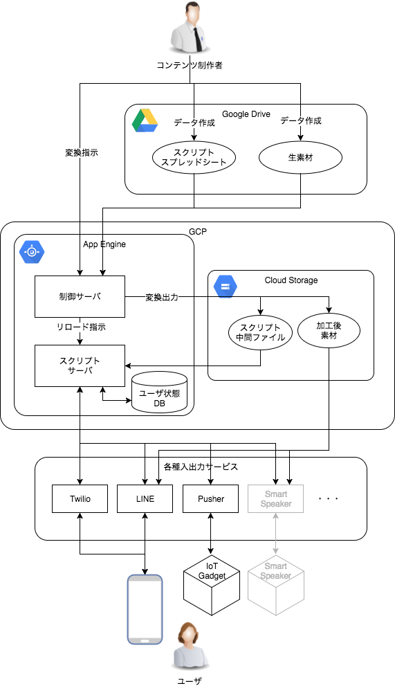

# XStoryBot - Transmedia Storytelling Bot

## 概要

複数のメディアを横断するストーリーテリングでの利用を意図して設計された、チャットボットシステムです。

自然文入力への対応が弱い代わりに、決められたワードの入力に反応して、インタラクティブなストーリーを提供することを得意としています。

シナリオを Google Sheets 上で記述できるため、シナリオ作成者との作業分担が行いやすいという特徴もあります。

現在の公開版は Python 3.11 で動作し、Cloud Run または AWS 向けに構成されています。

### プロジェクトの状態

- 小規模な実験では安定して動いていますが、負荷テストも行っていない、α版の品質です。
- ドキュメントがほとんどありません。
- 仕様は大幅に変わる可能性があります。
- 個人の趣味のプロジェクトですので、あまり精力的な開発はできません。

## システム構成
上半分のコンテンツ制作者から見えるシステムと、下半分のユーザから見えるシステムに分かれます。



この構成図は旧GAE版を基にした概念図です。現行版のGCP構成ではCloud Run、AWS構成ではAPI Gateway、Lambda、Fargateなどが、図中のGoogle App Engineに相当する役割を担います。Webchatだけは署名付き状態をbrowserへ保存し、図中のユーザ状態DBを利用しません。

## できること

ユーザからの入力テキストに対して、どんな反応を返すのか、スプレッドシート上で定義します。
条件は、入力に含まれる語（部分一致）、または正規表現で記述できます。

シナリオはシーン単位で管理されており、シーン毎にユーザへ異なるリアクションを提供できます。
ユーザ毎に現在どのシーンに居るかが保存されています。

また、記述方法がこなれていないためオススメできませんが、フラグ管理にも対応しています。

複数のbotを同時に実行できます。ユーザの状態は既定ではbotごとに分離され、同じ`state_namespace`を設定したbot間では共有できます。

## 対応サービス

plugin によって拡張可能な設計になっています。
現時点で対応しているサービスは以下の通りです。

### ユーザとの対話

- LINE@ のボットシステム（[LINE Messaging API](https://developers.line.me/ja/services/messaging-api/)）
  - ボタン・カルーセル・イメージマップなど、一部の特殊表示に対応しています。
  - 送受信は`requests`で直接行い、LINEのSDKには依存しません。
  - WebHook などを契機にした Push messages にも対応していますが、友だちが50人を越えると[月額32400円が必要](https://at.line.me/jp/plan)です。
- [Twilio](https://twilio.kddi-web.com/) （電話・SMS）
  - 電話がかかってきたことをトリガーに SMS を送信し、返信の内容によって電話をかける、といったことが可能です。
  - しかし、電話にせよ、SMS にせよ、とにかく[単価が高い](https://twilio.kddi-web.com/price/)ため、大規模な利用は困難です。
- WebAPI（認証付き action API）
- Webchat（AWSの署名付きclient state方式）
  - 導入方法、対応範囲、client組込みは[Webchatガイド](./docs/webchat.md)を参照してください。
  - 限定したシナリオは[API不要の体験版](./docs/webchat-trial.md)として静的ファイルだけで配信できます。
  - API契約は[OpenAPI 3.1](./docs/webchat.openapi.yaml)、表示データは[JSON Schema](./docs/webchat-message-spec.schema.json)で公開しています。

### IoT 機器などとの連携

- [Pusher](https://pusher.com/)
- 一般的な WebHook

### シナリオファイルの読み込み

- Google Sheets

## インストール手順

このリポジトリを clone した上で、Python 3.11 環境へ必要なパッケージをインストールします。依存は接続先ごとに分かれています。

    > git clone https://github.com/alt-core/XStoryBot.git
    > python3 -m pip install -r requirements-gcp.txt      # GCP に接続する場合
    > python3 -m pip install -r requirements-aws.txt      # AWS に接続する場合
    > python3 -m pip install -r requirements-optional.txt # Twilio／Pusher plugin を使う場合だけ

`requirements.txt`は共通の依存で、クラウド接続には上記provider別の依存を使います。ローカルのシナリオ開発・LINE検証・Webchatは共通依存だけで実行できます。手順は[ローカル開発ガイド](docs/local-development.md)を参照してください。エンジン全体の開発・テストには`requirements-dev.txt`（全部入り）を使います。

Twilio と Pusher は任意 plugin です。使う場合は`requirements-optional.txt`を追加で install し、`settings.yaml`の`plugins`に次のように書きます（値は環境変数から渡します）。Docker では`--build-arg XSBOT_EXTRA_REQUIREMENTS=requirements-optional.txt`を付けます。

    plugins:
      twilio:
        sid: !env TWILIO_SID
        auth_token: !env TWILIO_AUTH_TOKEN
        phone_number: !env TWILIO_PHONE_NUMBER
      pusher:
        app_id: !env PUSHER_APP_ID
        key: !env PUSHER_APP_KEY
        secret: !env PUSHER_APP_SECRET
        cluster: !env PUSHER_APP_CLUSTER

More（`line.more`）も任意 plugin です。追加パッケージは不要で、既存シナリオの移行などで使う場合だけ`settings.yaml`の`plugins`に追加します。

    line.more:
      command: ["▼"]
      image_url: "https://example.com/path/to/more_button.png"
      message: "「続きを読む」"
      action_pattern: null
      ignore_pattern: "^「|^リセット$|^\\*共通/リセット$"
      please_push_more_button_label: "##please_push_more_button"

`command`はシナリオで使う記号に合わせ、案内先の`##please_push_more_button`ラベルも用意してください。画像テキストの標準フレームは`more_mode: quick_between`でQuick Replyを使います。`inner`／`between`／`always`でMoreを使うフレームには`line.more`が必要です。WebchatのMoreも同じ設定で有効になります。

画像テキストでMoreを使う場合は、`line.image_text.more_message`を指定します。フレームの`more_message`またはコマンドの第3引数でも指定できます。`between`／`always`では`line.image_text.more_image_url`も必要です。`inner`は本文画像をボタンにするため追加画像URLは不要で、`quick_between`／`quick_always`では両項目とも不要です。

Cloud Runへデプロイする場合は、利用するGCPプロジェクトを準備してください。

以下、特殊な前準備が必要です。

- https://console.developers.google.com/apis/api/sheets.googleapis.com/overview
  - 展開先のプロジェクトにて、Sheets API を有効化
- 同様の手順で Google Cloud Storage も有効化
- Firestore に複合 index を作成（collection `group_message_tasks`、`bot_name` 昇順 + `created_at` 降順）
  - ダッシュボードのグループ配信履歴で使います。未作成の場合はその一覧だけが失敗し、ログに作成用URLが出ます
- GCP のダッシュボードでサービスアカウントを作成
  - json 形式でクレデンシャルファイルをダウンロード
- Google Sheets でシナリオのスプレッドシートを作成
  - 共有で上述のサービスアカウントのメールアドレスに招待
    - 招待する時は「通知」のチェックボックスを外す
- LINE@ を使う場合
  - LINE@ のアカウントを作成し、接続に必要な情報をメモ
  - LINE@ の webhook に 〜/line/callback/＜botname＞ を設定
- Twilio を使う場合
  - Twilio の電話番号を取得し、必要な情報をメモ
  - Twilio の webhook に 〜/twilio/callback/＜botname＞ を設定

続いて、設定ファイルと環境変数を準備します。初回に記入例をコピーし、コンテンツ用の設定を作成します。既存の`settings.yaml`がある場合は上書きしないでください。

    > cp settings.yaml.template settings.yaml

`settings.yaml`を必要に応じて編集し、`.env.template`に列挙された環境変数を実行環境へ設定してください。ローカル実行とDockerイメージは同じ`settings.yaml`を使います。ファイルが無い場合や空の場合、Dockerビルドは停止します。`settings.yaml`は公開Gitへ追加せず、秘密値は直書きせずに`!env`等で実行環境から渡してください。別コンテンツの設定やバックアップはビルド対象ディレクトリの外に保管します。`XSBOT_DEPLOY_ENV`には適用する環境別設定（例: `prod`、`stg`、`dev`、`test`、`local`）を指定します。`XSBOT_CLOUD_PROVIDER`は`gcp`または`aws`を必ず明示し、未設定時は誤ったbackendへ接続せず起動を停止します。

GCPとGoogle Sheetsで使うサービスアカウントJSONはコンテナイメージへ含めず、Secret Managerから読み取り専用ファイルとしてマウントし、それぞれのコンテナ内パスを`GOOGLE_APPLICATION_CREDENTIALS`と`SHEETS_SERVICE_ACCOUNT`へ指定してください。同じサービスアカウントを使う場合は、両方に同じパスを指定できます。

sheet_id は Google Sheets の編集時に URL に含まれるランダム英数字です。
api_token は、WebAPI などでの認証のために使われる情報です。必ず独自の値を設定してください。

利用するpluginとBot interfaceは`settings.yaml`で設定します。`settings.yaml.template`は記入例として維持します。

設定後、`Dockerfile`からコンテナイメージを一度ビルドし、同じイメージをCloud RunのAPI用サービスとビルダー用サービスへデプロイします。イメージには接続先の依存だけが入ります（`--build-arg XSBOT_CLOUD_PROVIDER=gcp`、既定はgcp）。Twilio／Pusher pluginを使う場合は`--build-arg XSBOT_EXTRA_REQUIREMENTS=requirements-optional.txt`を付けます。`XSBOT_CLOUD_PROVIDER`はイメージの環境変数として焼き込まれるため、Cloud Run側で別途設定する必要はありません（設定する場合は同じ値にしてください）。API用は既定の`app:app`を使い、ビルダー用だけ`XSBOT_APP_MODULE=app_builder:app`を設定します。それぞれのURLを`XSBOT_APP_BASE_URL`と`XSBOT_BUILDER_BASE_URL`へ指定し、Cloud Tasksには同じプロジェクト・リージョンで`build-queue`、`action-queue`、`group-message-queue`の3キューを作成します。現行のTaskQueueはOIDCトークンを付けないため、両サービスはCloud IAMで未認証HTTP呼び出しを許可し、保護が必要なrouteはWebhook署名、フォーム認証、または`X-API-Token`で保護します。

Cloud RunのCPU、メモリ、最小・最大インスタンス数は、Cloud Runサービス側で設定してください。

現行GCP実装はシナリオとメディアをオブジェクトACLで公開します。そのため、保存先にはオブジェクト単位の公開を許す専用バケットが必要で、Uniform bucket-level accessとPublic Access Preventionは有効にできません。バケット全体を公開する必要はありません。

共有APIトークン（`api_token`）で利用できるAPIは次のとおりです。認証には`X-API-Token`ヘッダーを使います。ヘッダーがない場合はqueryまたはformの`token`も受け付けますが、URLやログに残りやすいため、ヘッダーを推奨します。

- `GET`／`POST /api/v1/bots/<bot_name>/action`: 指定した利用者としてactionを実行します。`user`は`サービス名:ユーザーID`（例: `line:user,U...`）、`action`は実行するaction、`interface`は任意の実行interfaceです。
- `POST /api/v1/groups/<group_id>/add_members`、`GET /api/v1/groups/<group_id>/members`: グループのメンバーを追加・取得します。

GCP・AWSの非同期`@forward`と`@delay`は、親actionの状態保存と応答処理（LINE送信または応答生成）が成功した後に登録します。GCPの正の遅延は、その登録時刻を起点にします。子の登録に失敗しても、送信済みの親を再実行せず、残りの子の登録を続けます。

親の成功は、すべての子の登録・実行成功を保証しません。登録失敗は`XSBFail`の`phase: enqueue`として、`task`に宛先の`bot`・`action`・`interface`・`user`・`delay_seconds`・生成済みなら`task_id`を残します。未受理の子は自動再登録されず、AWSのDLQにも入りません。ログから対象を確認して復旧します。受付後の応答だけが失われた可能性もあるため、手動再投入では重複に注意してください。GCPの`task_id`は相関用で、重複実行を防ぐキーではありません。

グループ配信は、バッチの結果と進捗を保存してから次のバッチを登録します。次の登録に失敗した場合は、保存済みバッチを再送せず登録だけを再開します。取消状態は上書きしません。ただし、送信後・結果保存前の障害では再送が起こり得ます。GCPにはバッチの実行leaseを設けていないため、同じバッチの並行配送による重複送信も保証の対象外です。

グループ配信・失敗者再送・GCPの予約配信は、現在は限定提供です。利用する場合は、次の制約を前提にしてください。

- 配信開始から完了までグループのメンバーを変更しないでください。変更すると未達・重複送信・件数表示のずれが起こり得ます。
- 「待機中」は、workerへの登録成功を保証しません。初回の登録に失敗してもこの表示が残る場合があり、管理画面に登録を再開する機能はありません。
- 「失敗」はworkerが自動再試行することがある状態です。停止するには「中止」を使います。失敗者への手動再送は、元の配信が完了または中止してから行います。再送の対象は失敗が記録されたメンバーだけで、中止までに処理されなかったメンバーは含みません。中止時に既に実行中の送信は取り消せません。
- 中止時に実行中だったバッチの結果は、件数表示へ反映されない場合があります。失敗者一覧に記録が残っていても、表示上の失敗者数が0なら管理画面・APIからの再送はできません。
- 失敗者一覧を読み取れないときは、既存の一覧を上書きせず、手動再送もエラーにします。ただし、新しい失敗者の記録が保存障害時にも必ず残る保証はありません。
- GCPでは、次のバッチの登録失敗と同じバッチの重複受信が重なると、後続が自動再開しない場合があります。
- GCPの予約配信は最大約60秒早く実行され得ます。予約は30日以内にし、厳密な時刻やそれより先の予約が必要な用途では使わないでください。APIは30日の上限を検査しません。日時の入力はJSTとして扱います。AWSでは予約配信を利用できません。

### AWSへデプロイする場合

AWSではAPI GatewayとLambdaでHTTP APIを受け、`@delay 0`、非同期`@forward`、即時のグループ配信をLambdaの非同期呼出しで実行します。バッチ専用の`POST /api/v1/bots/<bot_name>/process_group_batch`はCloud Tasks向けの入口で、AWSでは実行できません。AWSのグループ配信は管理画面からworkerへ登録します。シナリオのbuildはFargateで行います。タスク待機の空ポーリングはなく、未使用時にその要求課金は発生しません。失敗記録を保管するSQSのDLQには常時受信するworkerを置きません。

AWSの`@delay`は数値の0だけを受け付け、正数・負数はbuildエラーになります。予約配信は提供しません。GCPではCloud Tasksによる遅延・予約配信を利用できます。AWS workerの同時実行上限はaction 10・group 2です。無料のReserved Concurrencyを使い、Provisioned Concurrencyは設定しません。デプロイ前にアカウントの未予約枠を100残せるquotaを確認してください。グループ配信の台本からもactionを登録できるため、大きな配信の同時開始時はLINEのrate上限に注意してください。

AWS CLI、AWS SAM CLI、DockerとAWS認証情報、既存のECR repositoryを準備してください。Google Sheets資格情報、管理者認証JSON、runtime秘密値JSONは、AWS管理KMSキーを使うParameter Storeの`SecureString`へ事前に登録します。

管理者認証JSONは`python3 tools/generate_admin_auth.py`で生成できます。

runtime秘密値JSONは、`settings.yaml`の`!env`へ渡す追加設定をまとめた文字列の辞書です。新しいプラグインの設定や、秘密ではないLINE LoginチャネルIDも、同じJSONへ追加できます。値の優先順位はJSON、プロセスの環境変数、未設定なら空文字です。例えば次のJSONで、`!env LIFF_LOGIN_CHANNEL_ID`と`!env CUSTOM_PLUGIN_TOKEN`を解決できます。

```json
{
  "LIFF_LOGIN_CHANNEL_ID": "1234567890",
  "CUSTOM_PLUGIN_TOKEN": "REPLACE_WITH_YOUR_VALUE"
}
```

項目名には通常の環境変数名（英字・`_`で始まり、英数字・`_`で構成）を使い、値はNULを含まない文字列にします。`!format`の引数やBotごとの設定でも使えます。JSONにない値は既存の環境変数を参照し、JSONの空文字は明示的な空として優先します。参照していない項目は設定へ入りません。

追加値はYAMLの解決にだけ使い、`os.environ`は変更しません。プラグインには解決後の設定値を渡すため、追加値を読むには`!env`を使ってください。クラウド・保存先・キュー・サービスURLなどの基盤設定と、Webchatの署名・Scenario・公開条件は、環境変数や設定ファイルで確定します。追加JSONによってこれらが変わる場合は、値を表示せず起動を停止します。Webchat専用LambdaはこのJSONを読みません。

JSONはプロセスの初回読込後にキャッシュします。Parameter Storeだけを更新しても稼働中のプロセスには反映されません。設定更新時はAPI・worker・builderの実行環境を再起動または再デプロイし、新しい値を読むようにしてください。Webchatの署名鍵等は[Webchatガイド](./docs/webchat.md)のversion固定の手順を使います。

`AWS_REGION`、`XSBOT_AWS_STACK_NAME`、`XSBOT_AWS_ECR_REPOSITORY`、`XSBOT_AWS_ENVIRONMENT`、`XSBOT_AWS_SHEET_ID`、`XSBOT_AWS_SHEETS_CREDENTIAL_PARAMETER`、`XSBOT_AWS_ADMIN_AUTH_PARAMETER`、`XSBOT_AWS_RUNTIME_SECRETS_PARAMETER`を環境変数に設定し、下記の監視設定も選んで`./deploy_aws.sh`を実行します。通常のruntime秘密値そのものはスクリプトへ渡しません。Webchatを有効にする場合は、`XSBOT_WEBCHAT_ENABLED=true`、`XSBOT_WEBCHAT_SIGNING_KEY`、`XSBOT_WEBCHAT_SCENARIO_URI`も必要です。詳細は[Webchatガイド](./docs/webchat.md)を参照してください。

#### アラームを選ぶ

環境ごとの用途に合わせ、`XSBOT_AWS_ALARMS_ENABLED`を`true`か`false`で明示します。テンプレートの既定値は`false`です。デプロイ補助スクリプトは、未設定・不正ならAWS操作やイメージビルドより前に停止します。一度選んだ値は各環境のデプロイ設定へ保存してください。

| 環境変数 | SAM parameter | `true`にする用途 |
|---|---|---|
| `XSBOT_AWS_ALARMS_ENABLED` | `AlarmsEnabled` | DLQ・HTTP API 5xx・workerのDLQ配送失敗・Webchat errorの監視 |

例えば、組込み監視を使わない開発環境では次のようにします。

```sh
export XSBOT_AWS_ALARMS_ENABLED=false
./deploy_aws.sh
```

アラームは`AlarmsEnabled=true`のときに3つ、Webchatも有効なら4つ作ります。workerのDLQ配送失敗は、両workerの`DestinationDeliveryFailures`を合算する1つのアラームで監視します。メール通知には別途`XSBOT_AWS_ALARM_EMAIL`を設定し、初回のSNS購読確認メールを承認します。メールなしでも、`AlarmsEnabled=true`にして`AlarmTopicArn`のSNS topicへSlack等を接続できます。メール設定だけではアラームを作りません。アラームをOFFにしてもtopicと購読設定は維持し、メールアドレスに空文字を明示するとメール購読だけを削除します。

**監視を有効にしている間は、アクセスがなくても継続費用の対象です。** CloudWatch alarmは通知の発生・購読先の有無にかかわらず監視指標数で課金され、workerの配送失敗監視には2指標分が加わります。この構成は合計4指標、Webchatも有効なら5指標です。無料枠は環境ごとに独立して付くものではありません。[CloudWatchの料金](https://aws.amazon.com/cloudwatch/pricing/)も確認してください。

更新時に未設定のWebchat設定・通知先は、前回値を維持します。既にWebchatが有効なstackを通常更新する場合は、`XSBOT_WEBCHAT_ENABLED`を未設定にします。明示した`false`は無効化、明示したepochは互換性の変更です。許可origin・通知先は空文字を明示すると消去できます。既存の`.env`に設定が残っている場合も明示値として扱うため、維持したい項目はexportしないでください。Webchatのimageは、有効状態の指定を省略しても更新されます。

`.env.template`のAWSデプロイ入力を設定すれば、table、worker関数名、subnetなどのruntime値はSAMが各実行環境へ供給します。これらを手入力するのはローカルからAWS backendを直接使う場合です。`.env`ファイルは自動では読み込まれないため、必要な値を環境変数としてexportしてから実行してください。

API、2つのworker、Fargateで同じECR imageを共用するため、スクリプトはDockerで一度だけ`linux/amd64` imageをbuild/pushし、`ImageUri`をSAMへ渡します。同一imageの再buildを避けるため`sam build`は実行しません。imageにはAWS向けの依存だけが入り、Twilio／Pusher pluginを使う場合は`XSBOT_EXTRA_REQUIREMENTS=requirements-optional.txt`を設定してから実行します。

#### 非同期処理の運用

非同期呼出しの202応答は登録受付であり、実行・送信の成功ではありません。関数エラーは2回再試行し、失敗を既存DLQへ送ります。各eventの保持期限は1時間で、一連の物語やグループ配信全体の完了期限ではありません。throttleやLambda側のsystem errorは別のbackoffで再試行します。workerの同時実行上限を0にするとeventはDLQへ送られるため、処理待ちの保管を目的とした一時停止には使えません。

通常の例外ではleaseを解放して再試行します。claim直後のcrashでleaseを解放できなかった場合、再試行がleaseに阻まれることがあります。actionは360秒、groupは960秒のlease期限後にDLQから手動復旧してください。DLQの記録は14日保管し、`requestPayload`（タスクの封筒）、`responsePayload`、`requestContext.condition`を含みます。対応するworkerへ`requestPayload`だけを再投入し、受理を確認してからDLQのメッセージを削除します。例えば、actionの封筒を`request-payload.json`へ保存した場合は次のように実行します。

```sh
aws lambda invoke --invocation-type Event \
    --function-name your-stack-action-worker \
    --payload fileb://request-payload.json invoke-response.json
```

完了記録が残っている同じtask_idはskipします。ただし外部送信と完了記録の保存は原子的ではないため、送信後・保存前の失敗では再送が起こり得ます。登録応答の喪失後に別task_idで登録し直した場合も重複し得ます。失敗記録には元の入力に応答とmetadataが加わり、DLQの容量上限等で配送に失敗する可能性があります。DLQ件数に加えて、`DestinationDeliveryFailures`、`AsyncEventsDropped`、`AsyncEventAge`を確認してください。

## シナリオの作成

Google Sheets 上でシナリオを作成します。
基本的なSheet構成、scene、message、主要commandは[Scenario作成ガイド](./docs/scenario-authoring.md)を参照してください。

## ダッシュボードからシナリオ読み込み

デプロイ先のホストの 〜/dashboard/ にブラウザでアクセスすると管理画面が開きます。

ダッシュボードではユーザー名とパスワードによる認証が要求されます。管理者認証JSONは環境変数またはAWS Parameter Storeから設定してください。

ダッシュボードにある「シナリオ修正の反映」のボタンを押すことで、Google Sheets からシナリオを読み込み、選択したクラウドプロバイダーのオブジェクトストレージ上に中間ファイルを生成します。

この時、build処理の対象となる画像等のリソースファイルも同じオブジェクトストレージ上にコピーされますので、安定したサービス提供が可能です。

## ログ

@log コマンドで、ユーザがシーン中の特定の箇所に来た際にログを出力することが可能です。
GCPではアプリケーションログがCloud Logging、AWSではCloudWatch Logsに出力されます。GCPでBigQueryへ集計する場合は、Cloud LoggingからBigQueryへのシンクを設定してください。

Cloud LoggingからBigQueryへエクスポートされるテーブル名とスキーマは、シンク設定とログ形式によって異なります。実際に作成されたテーブルとフィールドを確認してクエリを作成し、ビューとして保存してください。

## ユニットテスト

### 準備

    > python3 -m pip install -r requirements-dev.txt

### 実行

    > ./test.sh

## 注意事項

Cloud Run、Firestore、Cloud Storage、Cloud Tasks、Cloud Logging、BigQueryに加え、AWSのLambda、API Gateway、DynamoDB、S3、CloudFront、Fargate、CloudWatchとDLQへの配送・手動受信などの[SQS要求](https://aws.amazon.com/sqs/pricing/)は従量課金の対象です。

不具合により、意図しない課金が発生したとしても、補償いたしかねますので、[アラート](https://cloud.google.com/billing/docs/how-to/budgets?hl=ja&ref_topic=6288636&visit_id=1-636539550464473783-319035179&rd=1)などをご活用ください。

開発環境を作り直す場合は、[再構築の手順](./docs/migration.md)を参照してください。
